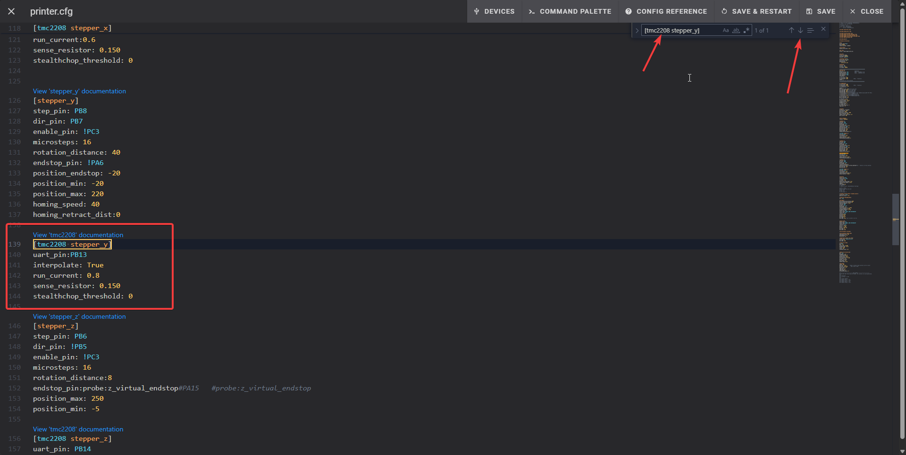

# Fixing Layer shift and nozzle grinding prints
## IMPORTANT!!!
In this tutorial you will have to do some adjustments in printer config, **make sure to read all the steps closely**,
as these changes involve changing hardware settings,
which can break your printer if you don't follow them and decide to make changes yourself,
I'm not responsible if you make changes that is not told to do. **Follow with caution!!!!!!!**

1. Open Fluid in your browser or Ocra slicer, for this tutorial will use the browser, 
but if you have Ocra slicer set up, **skip to step 4**.
2. Open your browser.
3. Type `YOUR_PRINTER_IP:4408` for example `192.168.0.100:4408` and click enter.
4. Click on icon that look like `{...}`.
    
5. Find file named `printer.cfg` and open it.
    
6. When you see a lot of text in there, `CTRL + F` to open search function.
7. In search bar type `[tmc2208 stepper_y]`. It should take you to the exact text you typed, if not, 
use arrow keys to navigate down.
8. You should see something like this:
    ```TEXT
    [tmc2208 stepper_y]
    uart_pin:PB13
    interpolate: True
    run_current: 0.6
    sense_resistor: 0.150
    stealthchop_threshold: 0 
    ```
9. Now edit line `run_current: 0.6` to `run_current: 0.8`
    ```TEXT
    [tmc2208 stepper_y]
    uart_pin:PB13
    interpolate: True
    run_current: 0.8
    sense_resistor: 0.150
    stealthchop_threshold: 0 
    ```
   
10. Now in search bar type `[tmc2208 stepper_z]`, it should take you to something like this.
    ```TEXT
    [tmc2208 stepper_z]
    uart_pin: PB14
    interpolate: True
    run_current: 0.6
    stealthchop_threshold: 0
    sense_resistor: 0.150
    ```
11. Change the value of `run_current: 0.6` to `run_current: 0.8` like this:
    ```TEXT
    [tmc2208 stepper_z]
    uart_pin: PB14
    interpolate: True
    run_current: 0.8
    stealthchop_threshold: 0
    sense_resistor: 0.150
    ```
    
12. Click `Save & Restart`
    