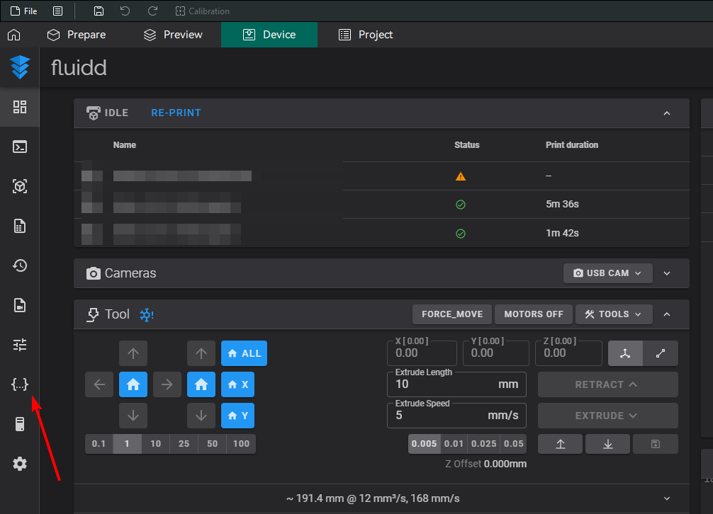
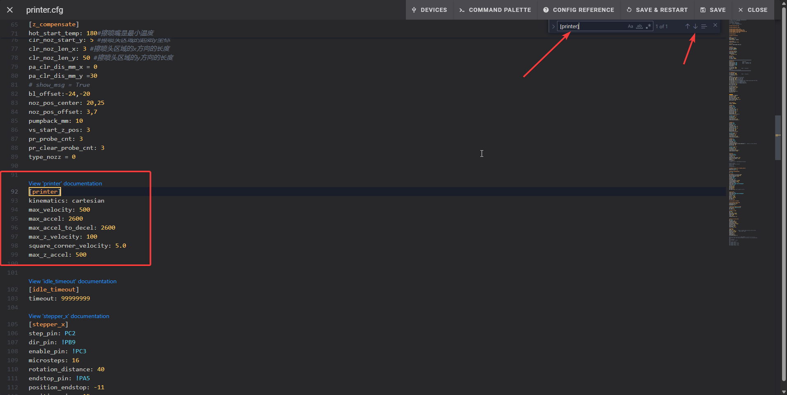
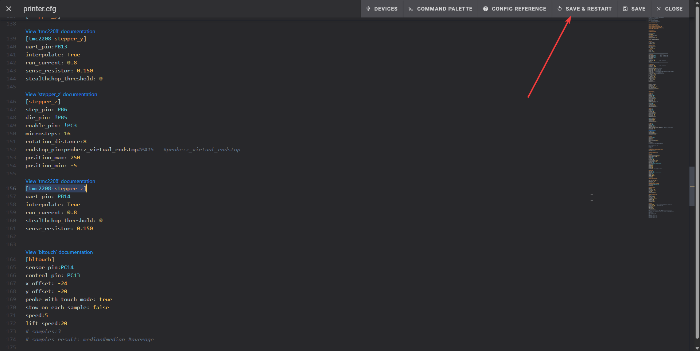

# Limiting Speed of the printer
## IMPORTANT!!!
In this tutorial you will have to do some adjustments in printer config, **make sure to read all the steps closely**,
as these changes involve changing hardware settings,
which can break your printer if you don't follow them and decide to make changes yourself,
I'm not responsible if you make changes that is not told to do. **Follow with caution!!!!!!!**

1. Open Fluid in your browser or Ocra slicer, for this tutorial will use the browser,
   but if you have Ocra slicer set up, **skip to step 4**.
2. Open your browser.
3. Type `YOUR_PRINTER_IP:4408` for example `192.168.0.100:4408` and click enter.
4. Click on icon that look like `{...}`.
   
5. Find file named `printer.cfg` and open it.
   
6. When you see a lot of text in there, `CTRL + F` to open search function.
7. In search bar type `[printer]` and you should see something like this:
   ``` cfg
   [printer]
    kinematics: cartesian
    max_velocity: 500
    max_accel: 5000
    max_accel_to_decel: 5000
    max_z_velocity: 100
    square_corner_velocity: 5.0
    max_z_accel: 500 
   ```
8. Change the lines:
   - `max_accel: 5000` to `max_accel: 2600`
   - `max_accel_to_decel: 5000` to `max_accel_to_decel: 2600`
9. After changing them, they should look like this:
   ``` cfg
   [printer]
    kinematics: cartesian
    max_velocity: 500
    max_accel: 2600
    max_accel_to_decel: 2600
    max_z_velocity: 100
    square_corner_velocity: 5.0
    max_z_accel: 500
   ```
   
10. Click `Save & Restart`
       
