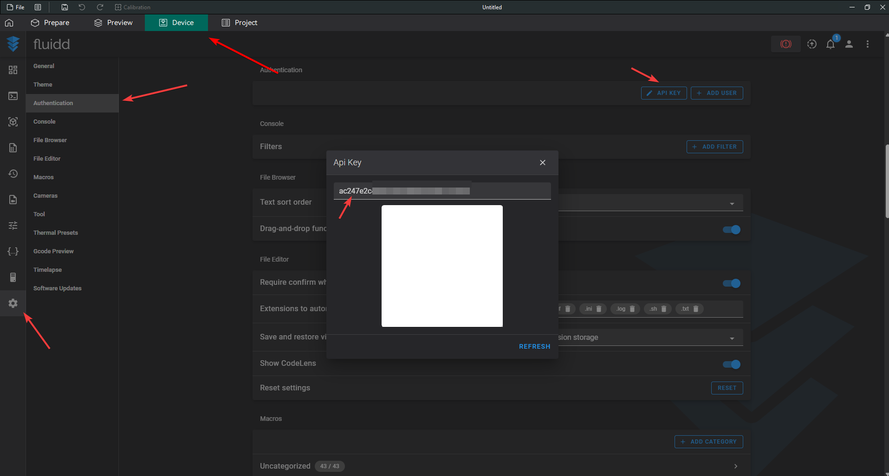

# Getting Api token

1. Open browser or OcraSlicer
2. Open **fluid** by entering **YOUR_PRINTER_IP:4408** or clicking **Device** tab, if you are on OcraSlicer.
3. Click **Cog** icon.
4. Click **Authentication**.
5. Click **API KEY**.
6. Copy the api key shown and use it where you need it.

    