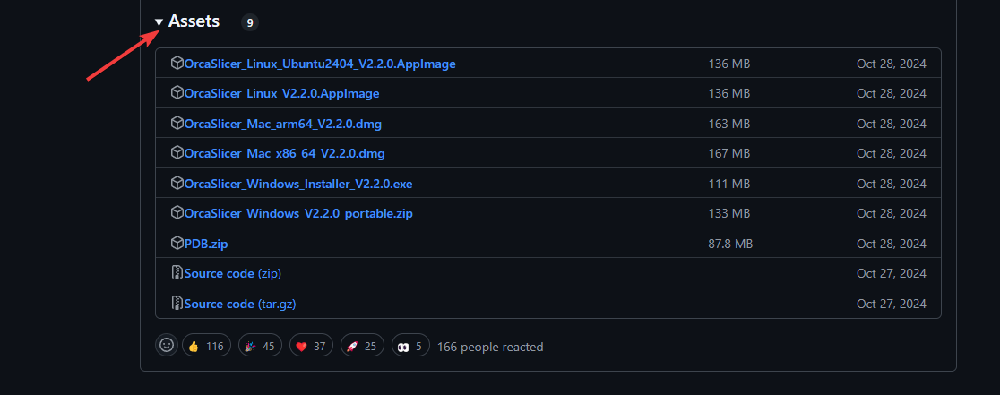
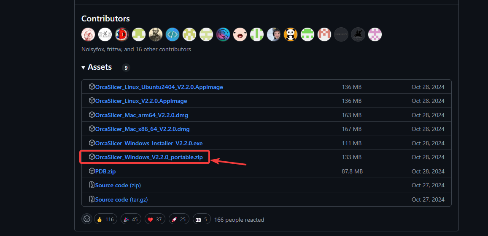
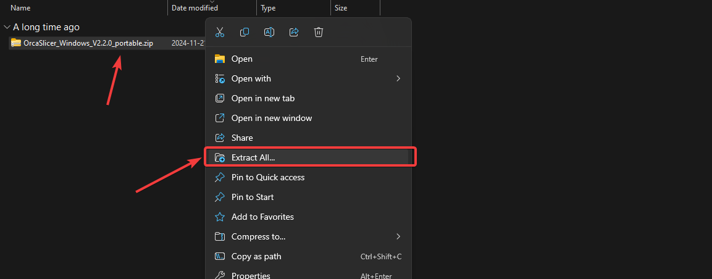
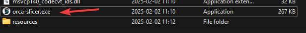
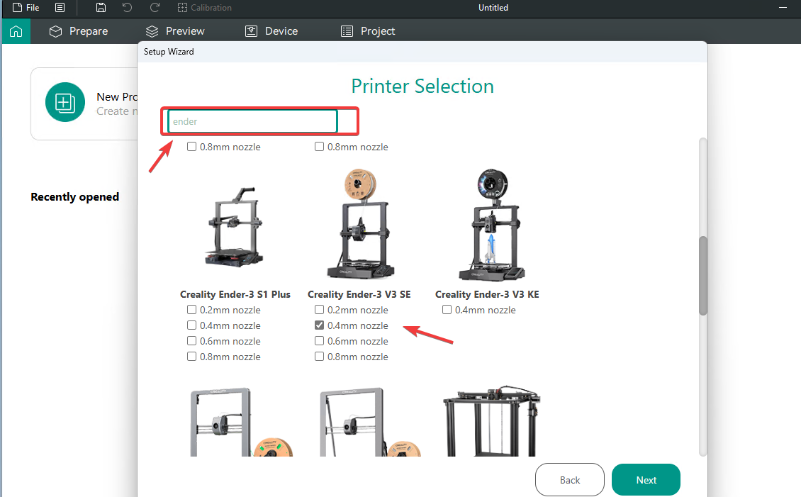
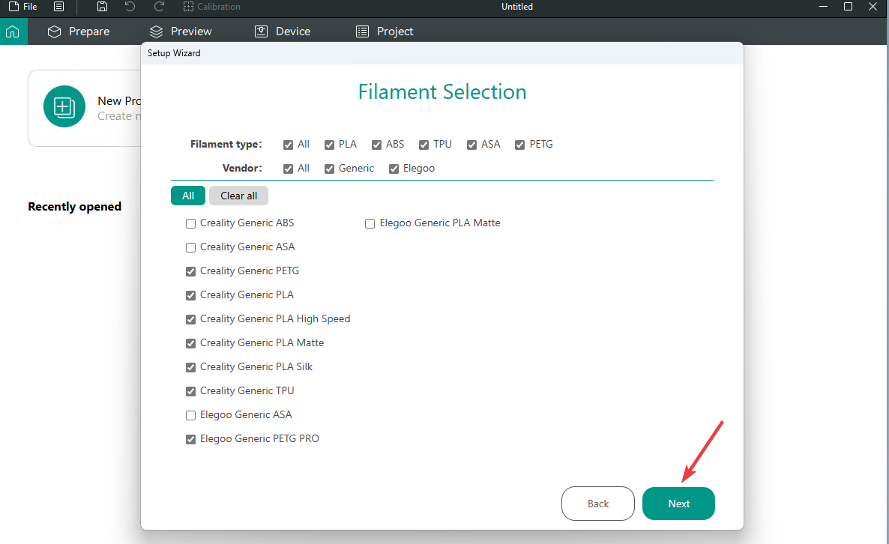

# Installing OcraSlicer for the first time

1. Open browser, navigate to [OcraSlicer GitHub](https://github.com/SoftFever/OrcaSlicer).
2. [Click releases](https://github.com/SoftFever/OrcaSlicer/releases).
3. Scroll down to **latest** (not **pre-release**) version.
    
4. Click assets if it's not open.
    
5. From here you can download the one for your system, for the sake of this tutorial I'll use Windows portable version.
6. Click download Windows, portable.
    
7. Open the download folder, where you have downloaded the portable version.
8. **Right-click** on the **zip** and click **extract all**.
    
9. Click **Extract**.
10. Wait for it to complete and it should open the folder.
11. Open the extracted folder and open **orca-slicer.exe**.
    
12. When Ocra opens, click get started.
13. Select your Region.
    
14. In search bar type **Creality**.
15. Scroll down to the **Ender 3 v3 se**.
    
16. Click next.
17. Here you can select witch materials you are using/will use, you can still add them later. If you need more.
    
18. Click **next**.
19. Check the **enable stealth mode**.
20. Click **next**.
21. Click **finish**.
22. Now you can continue on [setting up the printer profile for klipper](./SettingUpPrinterProfile.md#setting-up-printer-profile)
