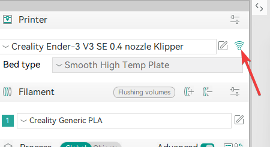
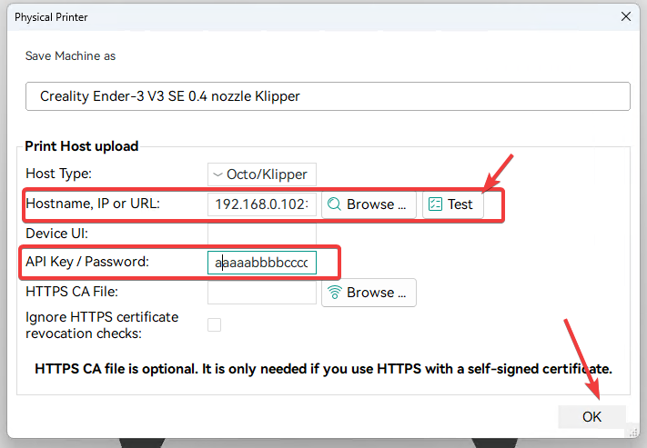

# Setting up remote printing

1. Click Wi-fi icon.

    

2. For `Hostname, Ip or URL` enter your `YOUR_PRINTER_IP:4408`. For example `192.168.0.102:4408`
3. Click test, it should say `success`.
4. For `API key/password` enter token, that you can get from [Getting Api Token](../GeneralTutorials/GettingAPITokenForRemotePrinting.md#getting-api-token)
5. Click `ok`.

    