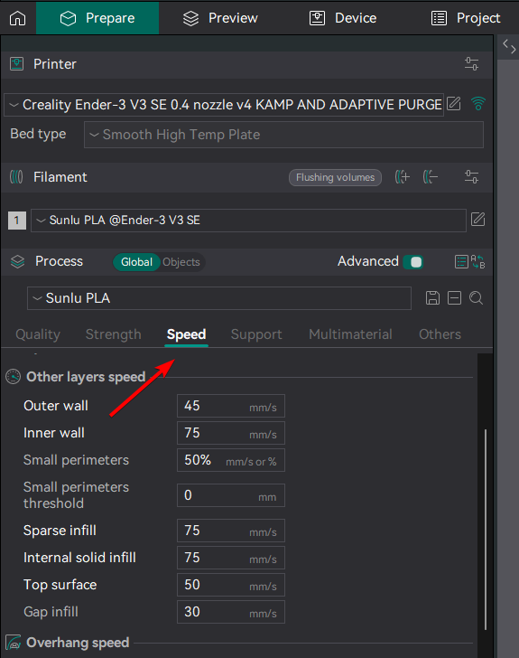
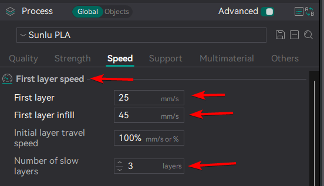
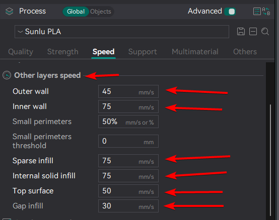
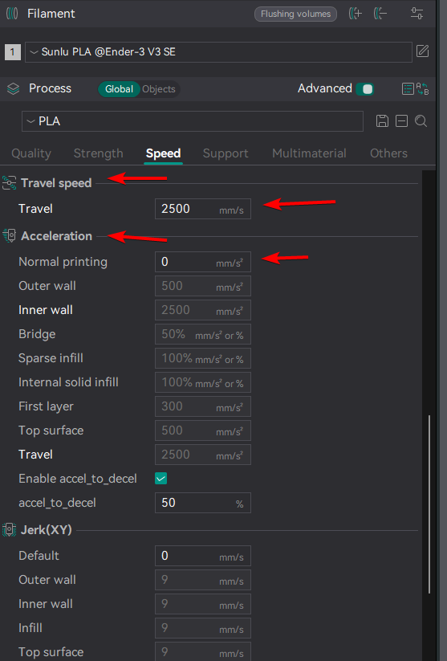
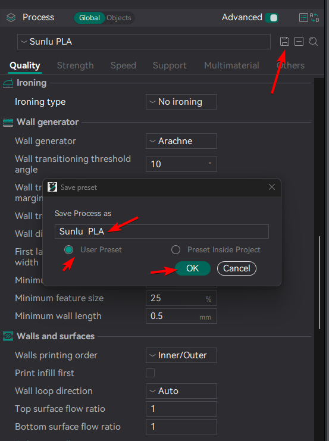

# Setting up Process Profile

!!! danger "Note"
    Speed changes in **Other layers speed** and **First layer speed** should be based on the filament you are using recommendations. **Below is my Sunlu PLA settings**.

1. Click **speed** tab.

    
 
2. Scroll down to **First layer speed** section.
3. In **First layer speed** section.
4. Change you should change these:
    - First layer: **25**
    - First layer infill: **45**
    - Number of slow layers: **3** (can be **2**, but I found **3** working the best, for me)

    

5. Scroll down to **Other layers speed**
6. In **Other layers speed** change these:
    - Outer wall: **45**
    - Inner wall: **75**
    - Spare infill: **75**
    - Internal solid infill: **75**
    - Top surface: **50**
    - Gap infill: **30**
   
    

7. Scroll down to **Travel speed**
8. Set:
    - Travel: **2500**
9. Scroll down to **Acceleration**
10. Set:
    - Normal printing: **0**
    
    

11. Scroll down to **Jerk(XY)**
12. Set:
    - default: **0**
13. Click save icon.
14. Name the profile. My recommendation is to use this naming schema: **Brand+filament type**, for example **Sunlu PLA**
15. Click **User preset**
16. Click **ok**.

    