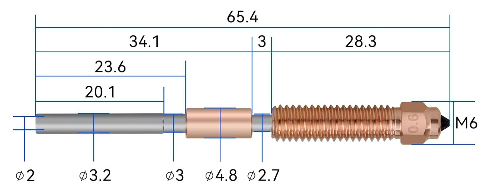
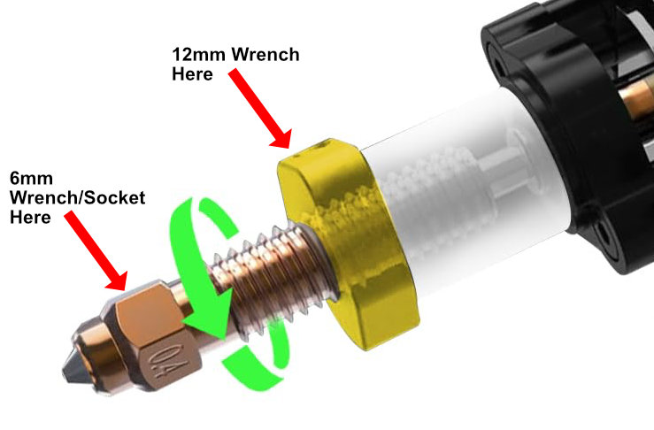

# Creality Ender-3 V3 SE/KE Ceramic Heating Block Kit

While the ceramic kit is nice, Creality doesn't provide much in the way of instructions beyond just installation.
Following are some tips that will help in the use of the nozzle.  

## Cleaning the Nozzle

Brass brushes are commonly used to clean nozzles from filament buildup. When using one, you must be very careful as the
bristles can get under the silicone sock and touch the wires on the ceramic heating block. If that happens, it can short
out the heater, break one of the wires, or otherwise cause damage.

If you want to be safe, you can try getting a small silicone brush and using that instead. There are also several
printable designs for a mount to hold a silicone wiper like what's used on the Bambu A1.

## Buying Replacement Nozzles

The ceramic kit uses Creality's "unicorn" style of nozzle. Unfortunately, with the K2 series printers being introduced,
there are multiple sizes of this nozzle style. When you want to buy replacement nozzles, make sure to buy the ones that
are labeled as being compatible with the K1C, which is the same size. The listings for these nozzles will also often
list the Ender V3 and V3 Plus as compatible.

Currently, the packaging for the two nozzle types is also different. The compatible nozzle has the "Unicorn" logo
printed in silver on the background. The incompatible K2 style has that logo in a metalic rainbow color. This acts as an
additional thing to check, but it's always best to confirm the list of compatible printers.

For reference, below is a diagram of a compatible nozzle with the dimensions marked.

{: style="max-width:400px"}
/// caption
Diagram of the Unicorn nozzle with measurements
///

## Replacing the Nozzle

When you replace the nozzle, you will need two wrenches. The nozzle itself is 6mm and the wrenches provided with the
printer or in a printer toolkit will work fine for the job. You will also need a 12mm open-end wrench for the hot end
itself. None of the wrenches provided with the printer or in most printer toolkits are the right size. You can also use
a small adjustable wrench if you don't have an open-end wrench.

### Applying the Thermal Paste

{: style="max-height:200px" align=right}
The little packet of thermal paste that came with the kit is for when you replace the nozzle. A thin layer should be
spread on the copper band above the threads. This lets the nozzle transfer heat into the heatsink much more efficiently.

You do not need to apply any paste to the nozzle in the kit unless you remove it and re-install it as it's already
applied initially.

### How to Safely Loosen/Tighten the Nozzle

{: style="max-width:200px" align=right}
When you loosen or tighten the nozzle, use the 12mm wrench or adjustable wrench to hold the copper band at the bottom of
the hot end. Do not try to hold anywhere on the white/ceramic portion of the hot end, it will damage and break it. Place
the 6mm wrench or socket on the nozzle itself.

With this arrangement, hold the 12mm wrench still and move the one on the nozzle to tighten or loosen the nozzle. Do
_not_ move the 12mm wrench as this will damage the hot end by causing the screws holding it together to pull out.

## Hot End Screws

!!! warning inline end "Risk of Damage"
    Replacing parts on the hot end may cause damage if done incorrectly. Should you choose to make modifications, these
    are done at your own risk.

The screws holding the heater block and the heatsink together are very short. While they will usually work fine, the
stresses of multiple heating and cooling cycles and changing the nozzle can cause them to loosen or even pull out. It is
a good idea to check that the heater block is not wobbly before beginning a print and while it is still cold.

If the stock screws do pull out, or if you want to be cautious, you can replace these screws with slightly longer ones.
You will want to use M2 x 10mm screws, as this will allow the screws to fully penetrate the heat sink and give you the
most secure connection.
