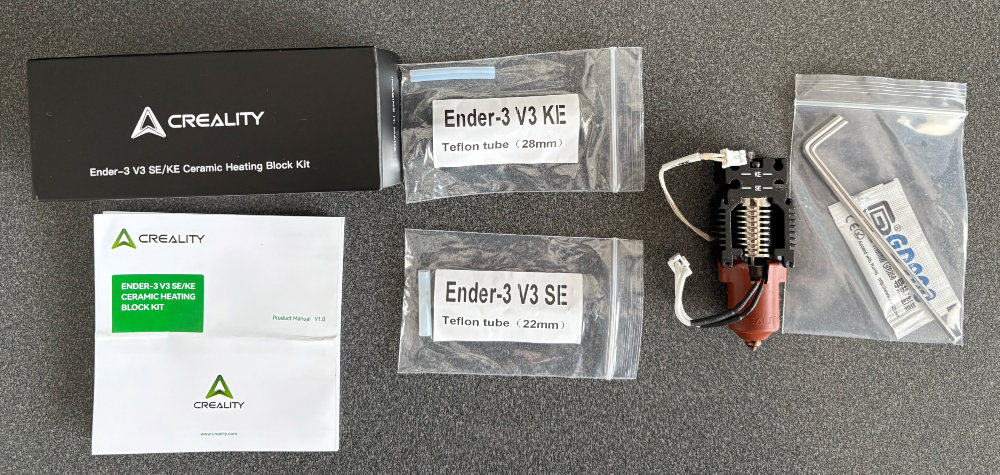
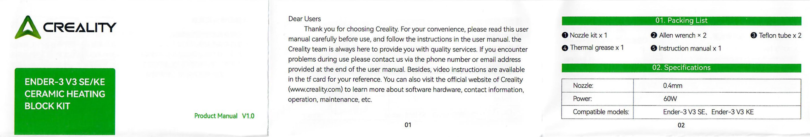
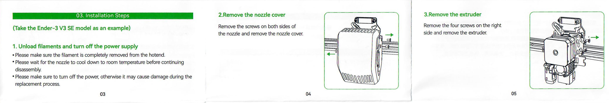
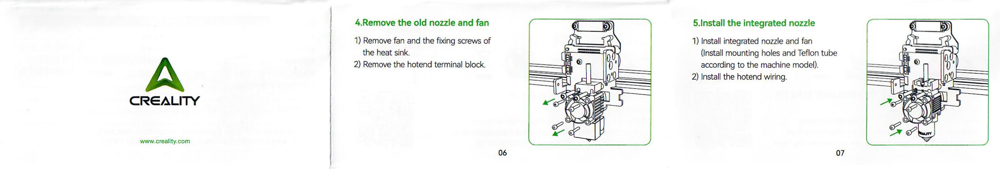
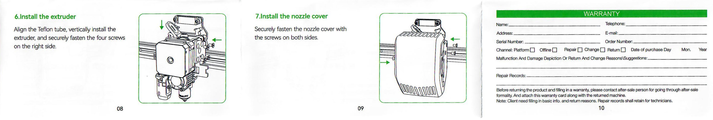

# Creality Ender-3 V3 SE/KE Ceramic Heating Block Kit

!!! danger "At Your Own Risk"
    3D FDM printers involve high temperatures, molten plastic, and electricity. Improperly done modifications may not only break your printer but may cause damage, personal harm, or death. Any modifications you make are at your own risk. Please make sure to follow all [safety](../safety.md) notes and your own common sense when working on your printer.

The official ceramic heating block kit replaces the stock hot end and heatsink with a new hot end that uses a ceramic heater and can heat up to 300°C. It also replaces the stock heatsink with an improved copper heat sink and uses the "Unicorn" quick-swap nozzle that is also used in the K1C.

## Kit Contents
The kit includes the following parts:

1. Nozzle kit (this includes the already-assembled heat sink, hot end, and nozzle)
2. Allen wrenches
3. Teflon (PTFE) tubes for both the SE and KE models
4. Thermal grease (used when switching the nozzle)

{ width=500 }

## Installation Steps

!!! important
    As you are changing the nozzle and positioning of the CR-Touch sensor, make sure to perform a Z offset and auto level when the installation process is complete. If you are using input shaping with the G-Sensor, this will also need to be redone. 

!!! tip "Tips"
    - You will be needing to remove quite a few parts to do this installation. Multiple screws and sizes of screws are involved. Make note of what screws go where so you don't mix them up on reinstall. Taking photos while you work is a good practice to keep things straight.
    - If you haven't worked on your printer before, you will see little blobs on the wire connectors. This is hot glue used to keep the wires from loosening during shipping. You can carefully peel these off using a tweezer designed for electronics or using a bit of isopropyl alcohol to loosen the glue. If you have a hairdryer or heat gun, you can _lightly_ heat up the area to make the glue a bit easier to pull off. If you use heat, be careful not to overheat the area as it could melt the connectors or damage the circuit boards.

### 1. Unload any filament and turn off the printer's power supply
- Make sure that the filament is completely removed from the hot end.
- If you were using the printer, make sure the nozzle has cooled down to room temperature before disassembly.
- Make sure the power is fully off before continuing. Not doing so may damage your printer.

### 2. Remove the nozzle cover
Remove the three screws holding on the cover. There is one screw on the left and two on the right. The part fan will still be connected, you can hang the wire on the tab at the back. 

### 3.Remove the extruder
The CR Touch is screwed into the side of the extruder, so make sure to unplug the extruder motor cable and the CR Touch cable. There are four screws on the right side holding the extruder assembly to the printer. Remove these screws and gently lift the extruder assembly up to remove it from the print head.

### 4. Remove the old nozzle and fan
The fan is reused on the new nozzle, so you will need to unscrew it from the heat sink. Unplug the fan and set it to the side. Unplug the two cables from the extruder assembly and then remove the two screws from the extruder heat sink to fully remove the part.

### 5.Install the new nozzle
Attach the new heat sink and nozzle to the print head. There are two positions for the screws depending on your printer model. The SE uses the set lower down. Plug in the new wires to the board. Push on the new teflon tube to the top of the nozzle assembly. For the SE you need to use the _shorter_ piece.

### 6. Reinstall the extruder
!!! tip
    This step may be a bit tricky because of all the wires and the small spaces, so if you find it difficult, you can unscrew the CR-Touch from the extruder, reinstall the extruder according to the instructions, then re-attach the CR-Touch.

Take the extruder assembly and align the hole in the bottom with the Teflon tube, then lower the assembly until the screw holes align with the mounting plate. You can now re-attach the wires for the extruder motor and the CR-Touch.

### 7. Reinstall the nozzle cover
Finally, securely fasten the nozzle cover with the screws on both sides.

## Manual
PDF Download coming soon

## References

Although there is no official video, at least one other party has made a video showing the overall process, and Creality has a video showing the swapping of the nozzle that can be used as a general reference.

- [Installation video by Red Dot Geek](https://www.youtube.com/watch?v=VWSeWucyS8A) - Good overall video, but you do not need to remove the nozzle, as is done in this video, which is just to show the new nozzle design.
- [Replacing the SE Hot End by Creality](https://www.youtube.com/watch?v=A-HNS4-mfLg) - Good overview of removing and installing a new hot end kit on the SE.
