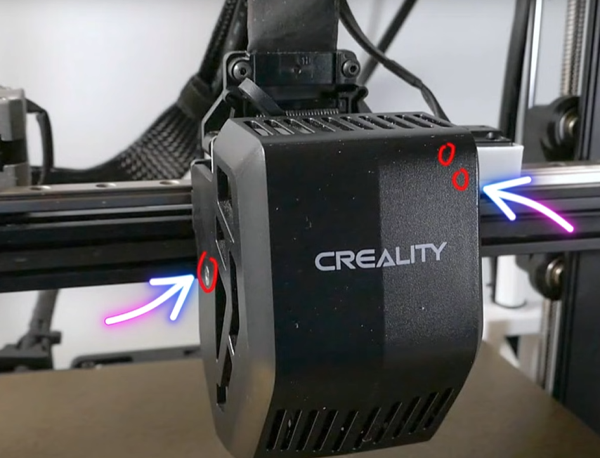
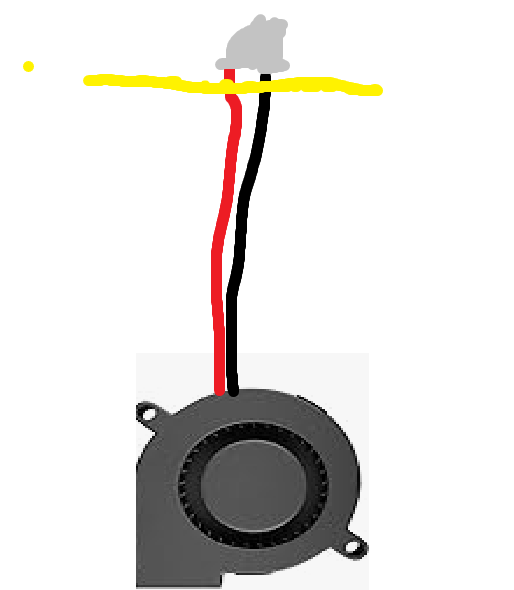
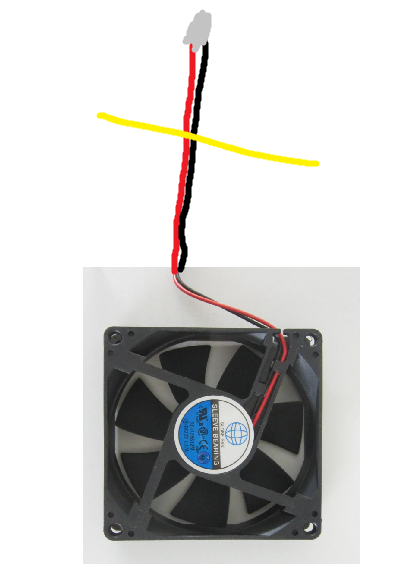
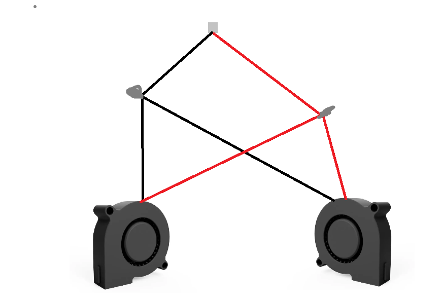
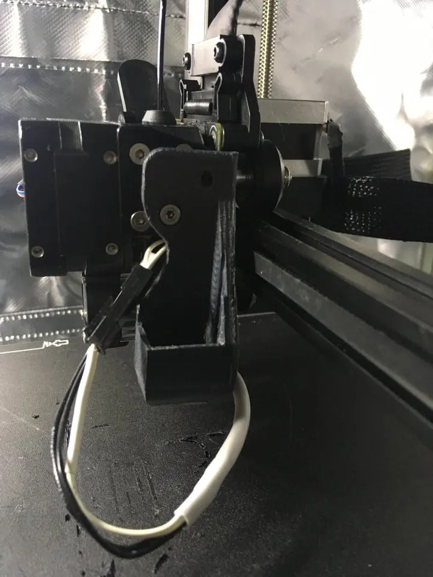
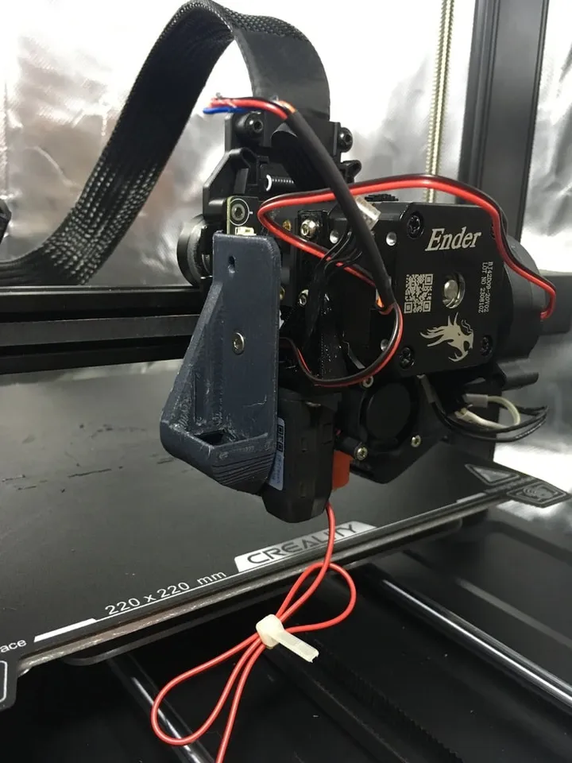
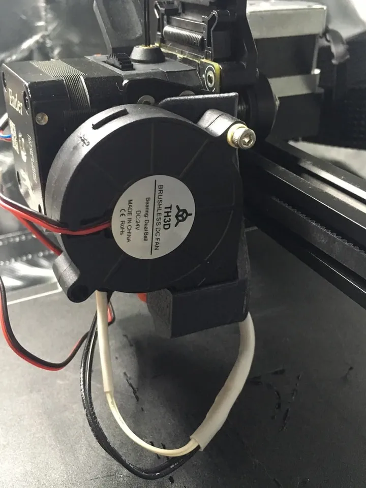
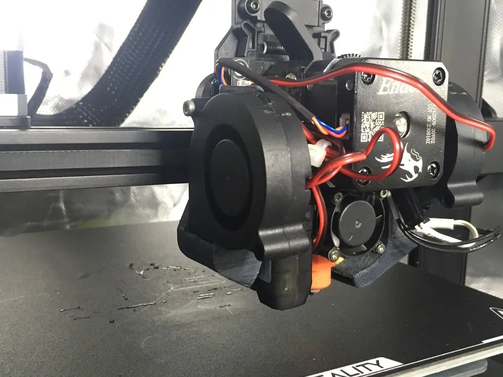

# Dual Fan Cooling

The dual fan cooling upgrade replaces the single part cooling fan with a paired fan setup that pushes air evenly from both sides of the nozzle.

!!! danger "At Your Own Risk"
    3D FDM printers involve high temperatures, molten plastic, and electricity. Improperly done modifications may not only break your printer but may cause damage, personal harm, or death. Any modifications you make are at your own risk. Please make sure to follow all [safety](../safety.md) notes and your own common sense when working on your printer.

!!! warning
     This modification requires cutting the original fan wires and splicing cables. Incorrect wiring can cause shorts, overheating, fire, printer damage, serious injury, or DEATH. Proceed only if you understand basic electrical safety, use proper insulation, and verify all connections before powering on the printer. Any modifications are done entirely at your own risk.

!!! note
    This requires basic knowledge of wire stripping and splicing techniques.
## Requirements

- 2x 5015 blower fans
- [Dual 5015 blower duct](https://www.printables.com/model/667051-dual-5015-blower-duct-for-ender-3-v3-se) (print the correct variant for your hotend—multiple versions are included and the notes explain which one to use)
- 1x M3x22 screw (for attaching the right side)
- 1x M3x24 screw (for attaching the input shaping mount on the right side)
- 1x M4x20 screw (for attaching the left side)
- 3x original countersunk screws from the cover

## Installation

1. Remove the extruder cover. 
Keep the screws

#### Wiring
2. Cut the wires of both 5015 fans near the connector (refer to the yellow line in the image below).

3. Cut the stock fan wire at the midpoint (refer to the image below).

4. Connect the wires according to the following diagram.

    - **Grey circles**: Stripped wires twisted together
    - **Grey rectangle**: JST connector

    !!! note
        Apologies for the rough diagram—a proper version is in the works.

5. Insulate all exposed wire connections using electrical tape or hot glue to prevent short circuits and ensure long-term reliability.

#### Attaching fans

!!! warning 
    MAKE SURE TO PLUG IN EVERYTHING BEFORE THIS

6. Screw in the mounts using the screws that came with the cover

7. Screw the right side using the M3x22 screw. (You might need to use a washer)

8. Screw the left side using the M4x20 screw. (This one doesnt need a washer)

!!! note
    Honestly its a little hard to install the left side 
     Try to push the fan back if you find it difficult

### Slicer configuration
Refer to [Cooling Speed Changes](../../orca-slicer/setup/filament-profile#cooling-speed-changes) 

### Input shaping
1. Remove the M3x22 screw from the left side
2. Install your prefered g sensor mount with a M3x24 screw  
I use this [model](https://www.printables.com/model/1309378-ender-3-v3-se-nebula-g-sensor-mount) and mounted with the top hole
3. Do your input shaping
4. Remove the g sensor mount
5. Reinstall the fan with the M3x22
## Benefits

- **Improved cooling coverage**: Airflow is distributed evenly from both sides of the nozzle, reducing warping and improving overhang performance.
- **Better print quality**: Symmetrical cooling helps achieve more consistent layer adhesion and surface finish.
- **Enhanced bridging**: Dual-sided airflow provides superior cooling for bridging and complex geometries.

## References

- [Dual 5015 Blower Duct on Printables](https://www.printables.com/model/667051-dual-5015-blower-duct-for-ender-3-v3-se)
