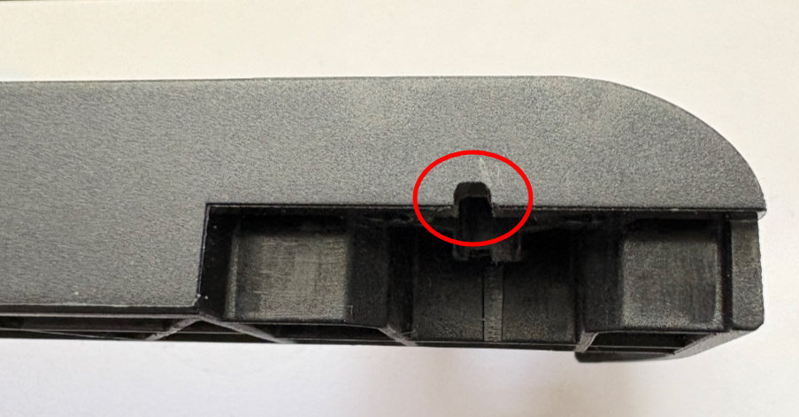

# Creality Ender-3 V3 SE LED Light Bar Kit

The stock install instructions aren't too bad, but there are some ways to make the installation look much cleaner.

## Hiding the Wire
With a tiny bit of work, you can keep the wire of the light bar hidden. While some of these steps are a bit overkill, they ensure the cord is both hidden and protected.

!!! warning At Your Own Risk
    Any modifications you make are at your own risk. Please make sure to follow all [safety](../safety.md) notes and your own common sense when working on your printer.

The vertical bars of the printer gantry are extruded aluminum and have a hollow channel in the center. This channel is large enough to run wires through. To do this, though, you need to get the wire from the light bar to the bars. This can be done by making a small notch in the top plastic cap:

{ width=300 }
{ width=300 }

When going down the channel, the wire will exit in a way that it needs to go around one of the tabs in the bottom cover. Because the edges can be sharp, it's recommended to cover the tab in a tape. Polyamide tape, often called Heat Tape or Kapton Tape, is a good option because it is a good insulator and heat-resistant. After putting down a few layers, you can slightly bend the front-facing corner to reduce the risk of pinching the wire. It's also recommended to tape the metal edge on the mounting plate against the base.

{ width=300 }
{ width=300 }

For extra protection, you can use a sleeve of heat-shrink tubing that goes slightly into the exit hole of the base.

{ width=300 }

You can now finish up the installation of the bar. At the end, when you put on the bottom metal cover, you'll have a very clean and protected route while hiding the wires for the bar.

{ width=300 }
