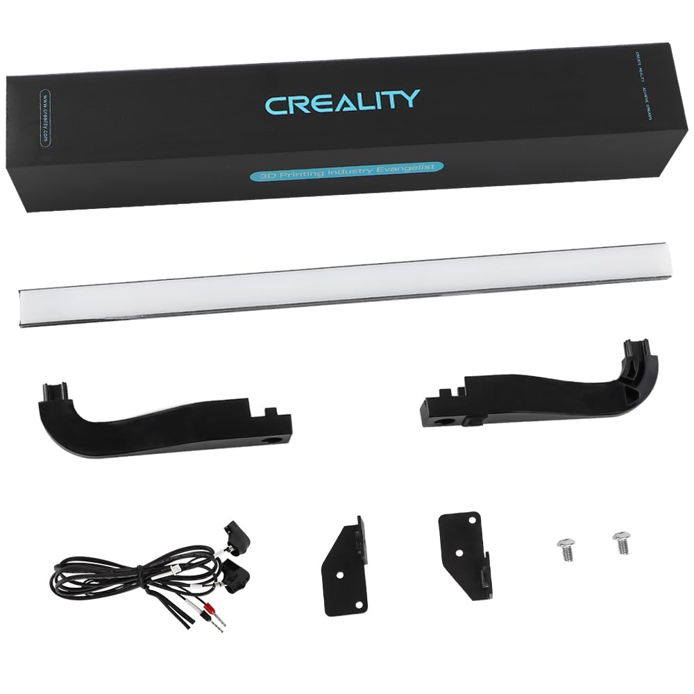
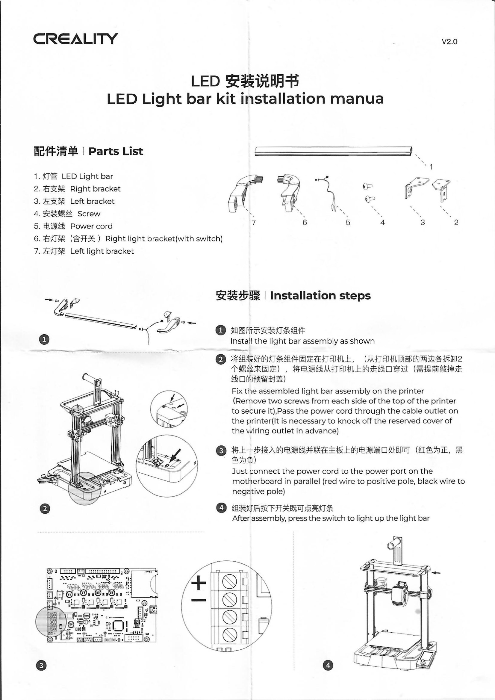

# Creality Ender-3 V3 SE LED Light Bar Kit

The official LED Light Bar kit is a nice addition if you want to add some extra lighting for the printer if you don't want to light the whole room, or if you run your printer in an enclosure. Since it's made for the SE, it fits perfectly on the printer without modifications.

## Kit Contents
The kit includes the following parts:

1. LED light bar (metal channel, diffuser, LED lightstrip)
2. Left and right light bar brackets
3. Left and right metal brackets
4. Screws
5. Power cord

{ width=500 }

## Installation Steps

1. Attach the cable to the end of the LED lightstrip. Attach the light bar brackets to the sides of the bar while routing the cable in the gaps in the bracket. The right-side bracket has the power switch. There are two square holes in the diffuser on each end that match with square tabs on the brackets. Attach the metal brackets to the light bar brackets using the screws in the kit.

2. Remove two screws from the top bar of the printer that slign with the holes on the metal bracket. If you don't want to run the cable down the inside of the gantry, you can run the cable through the knock-out port behind the Z axis screw.

3. Connect the power cable to the motherboard. You can loosen the screw terminals that already have the red and black wires in them and add the pins, then tighten the terminals again. Make sure to match the wire colors.

4. After installing, you can use the power switch on the LED bracket when the printer is on to work the light.

## Manual
[Download PDF](assets/lightbar-manual-2_0.pdf) of the manual.

{ width=500 }

## References
- [Official YouTube video](https://www.youtube.com/watch?v=-ebn8vLFhCM) - This video is a good walkthorugh, but makes a few questionable actions. In the video, the wire is run down the inside of the left gantry upright, but the right one is much easier and doesn't require running the cable so far. You may need to make a small cut in the top bar to let the wire go through to the inside of the extrusion.
- [Installation video by 3D Rundown](https://www.youtube.com/watch?v=tDFLqhUSvhA) - Goes into much more detail. Uses the knockout method to run the wire.
