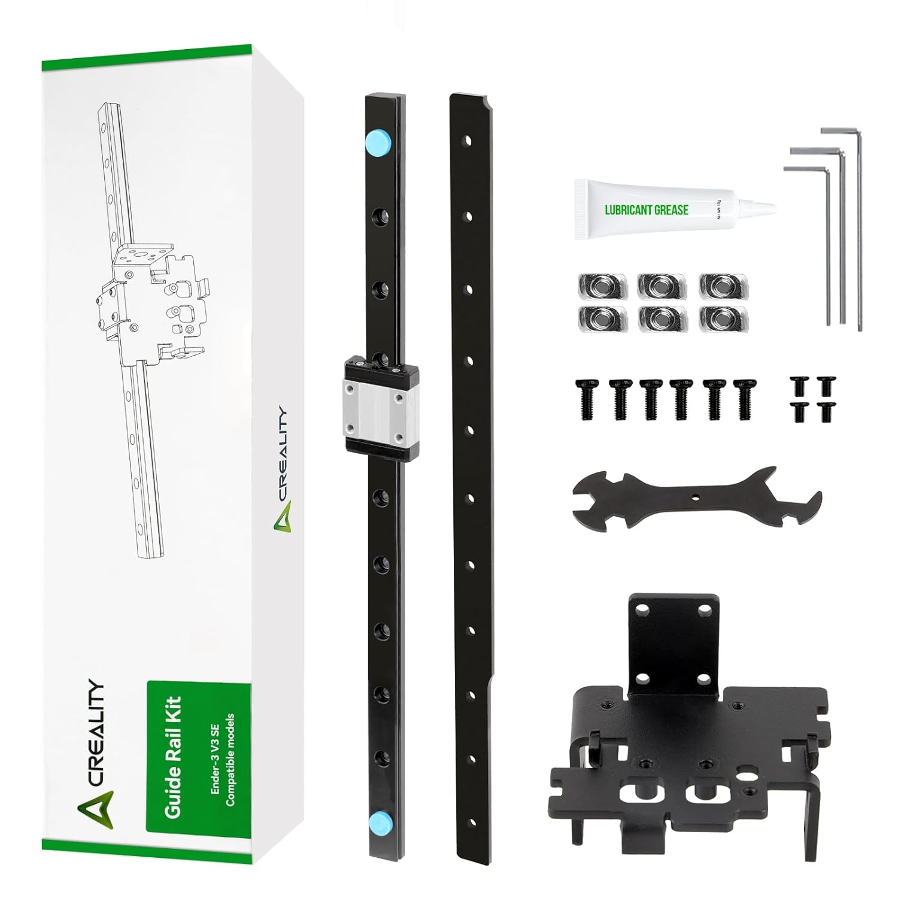
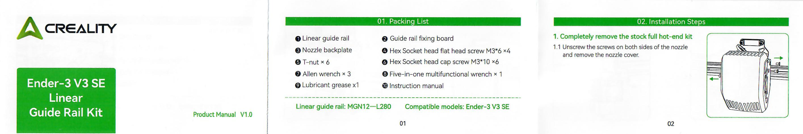
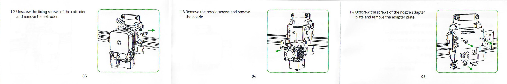
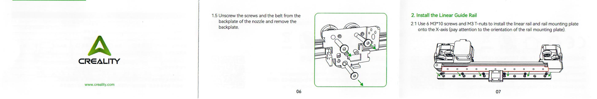
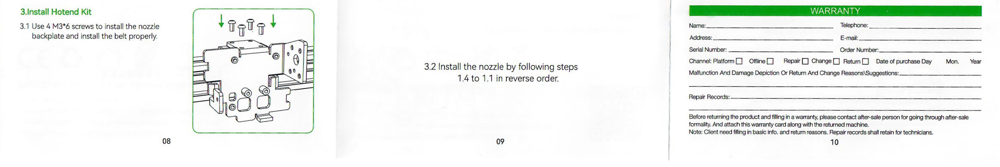

# Creality Ender-3 V3 SE Linear Guide Rail Kit

The official guide rail kit replaces the wheel-based X-axis movement with a linear rail like the KE has. While not
identical, due to the differences in the hotend, it works the same way.

## Kit Contents
The kit includes the following parts:

1. Linear guide rail and rail mounting plate
2. Backplate
3. M3x6 and M3x10 hex screws
4. T-nuts
5. Allen wrenches and multifunction wrench
6. Lubricant grease

{ width=500 }

## Installation Steps

!!! tip "Tips"
    - You will be needing to remove quite a few parts to do this installation. Multiple screws and sizes of screws are
    involved. Make note of what screws go where so you don't mix them up on reinstall. Taking photos while you work is
    a good practice to keep things straight.
    - If you haven't worked on your printer before, you will see little blobs on the wire connectors. This is hot glue
    used to keep the wires from loosening during shipping. You can carefully peel these off using a tweezer designed for
    electronics or using a bit of isopropyl alcohol to loosen the glue. If you have a hairdryer or heat gun, you can
    _lightly_ heat up the area to make the glue a bit easier to pull off. If you use heat, be careful not to overheat
    the area as it could melt the connectors or damage the circuit boards.

### 1. Remove the Full Hotend from the Stock Backplate

Unscrew the print head cover. There are two screws on the right and one on the left. Be careful, as the part fan is
screwed into the cover and the wire runs behind the hot end. You can carefully hang the cover down to the right.

You will be removing the extruder assembly and CR-Touch next. Unplug the cables for the extruder and the CR-Touch from
the circuit board. The entire assembly is held in with four screws on the right side. Unscrew these and then lift the
extruder assembly directly up, watching that you don't snag on any wires.

Next, you can remove the hot end and the attached fan. Unplug the cables for "Fan1", "TH", and "HEAT". Hold the hot end
carefully and unscrew the two screws at the top of the hot end above the cooling fan. **Be careful** as these two screws
are the only things holding it on.

With all the parts now removed, you can remove the circuit board. You do not need to remove the ribbon cable if you are
careful. There are three screws on the circuit board. Remove two screws at the top and one down lower between the
connectors. Carefully remove the circuit board and place it to the side or back.

The last step is to remove the backplate. To begin, loosen the belt by using the screw on the right endcap of the x-axis
bar. Be careful to not remove the screw completely. Loosen the belt just enough to slide the ends of the belt out of the
slots in the backplate. Do _not_ remove the belt entirely. Instead, you can allow the ends of the belt to hang down.
With the belt out of the way, loosen the wheels from the backplate. You can use one of the supplied wrenches on the head
of the bolt and one of the wrenches on the nuts on tbe back. Go slowly so the backplate doesn't fall down and damage the
build plate.

### 2. Installing the Rail

Take the two rail pieces. For the top rail, remove the plastic endcaps. These are usually blue, and are only to keep the
slider from sliding off the rail before it's installed. Next, use the supplied M3x10 screws and T-nuts to fasten the two
rail pieces together. You should use a screw in the outer holes on each side and then fill in the others, skipping every
other hole. Do not fully tighten the nuts.

Take the partly assembled rail and place it on top of the x-axis bar. The mounting plate has notches on one side to help
with orientation and positioning. The side with the notches should be toward the back of the printer, with the longer
notch being on the right. Once the bar is in place, tighten the screws. This will spin the T-nuts and lock them into the
bar so the rail is attached firmly.

### 3. Installing the New Backplate

You can now install the new backplate. Use the included screws to attach the top of the backplate to the slider on the
rail. Once the backplate is screwed on, attach the belt by sliding the ends of the belt into the slots on the backplate.
Make sure the belt is flat and not twisted. Once the belt is in, tighten it using the screw on the right endcap. The
belt should be firm, not overly tight. You can make further adjustments after everything is fully reassembled.

### 4. Finishing Up

With the new backplate on, you can re-install all the other parts by following the steps you used to disassemble the
print head in reverse order.

## Manual

PDF Download coming soon

## References

Although there is no official video, a few other parties have made decent videos. Unfortunately, they don't follow the
correct screw spacing for the rail. Make sure to check the manual for the correct screw locations.

- [Installation video by Prapat s](https://www.youtube.com/watch?v=1NQvPfC3OaQ): Good overview, but one **major
issue**. The installer does not remove the blue plastic stops that are only for shipping. Check the install manual for
the correct screw locations in the linear rail.
- [Installation video by Red Dot Geek](https://www.youtube.com/watch?v=K9OwPqOlRWE): Also a good overview, but a
similar **major issue**. They do not put the screws in the correct spots. The screws should be installed evenly down the
bar as shown in the installation manual.
