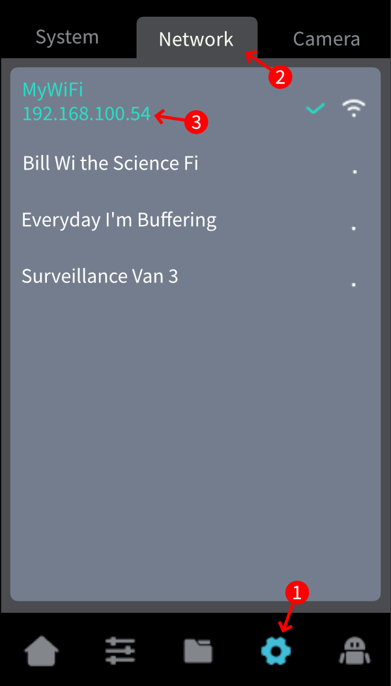

# Finding the Printer's IP

Finding the IP of your printer is very easy, just follow these steps:

{ width=300, align=right }

1. On the Nebula Pad, tap on the gear (:fontawesome-solid-gear:) icon.
2. Tap on the tab labeled `Network`.
3. The connected network will appear at the top of the list with the IP address directly under it.
