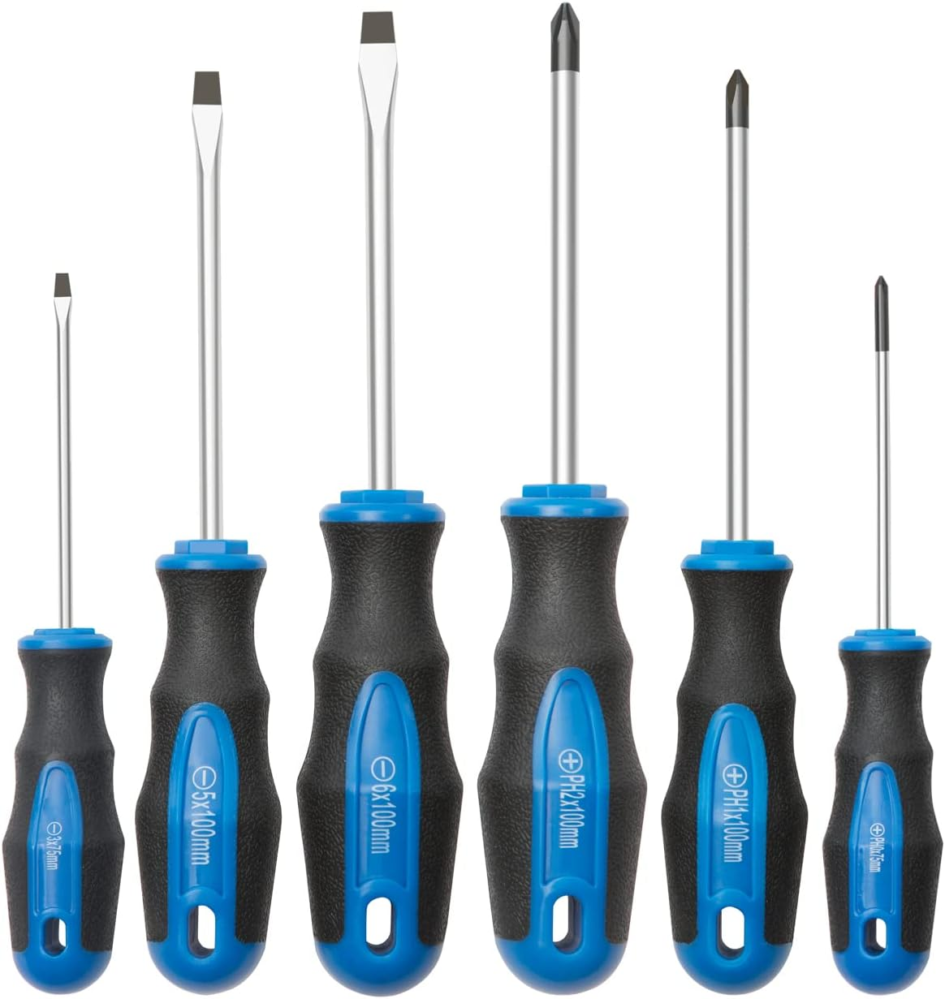
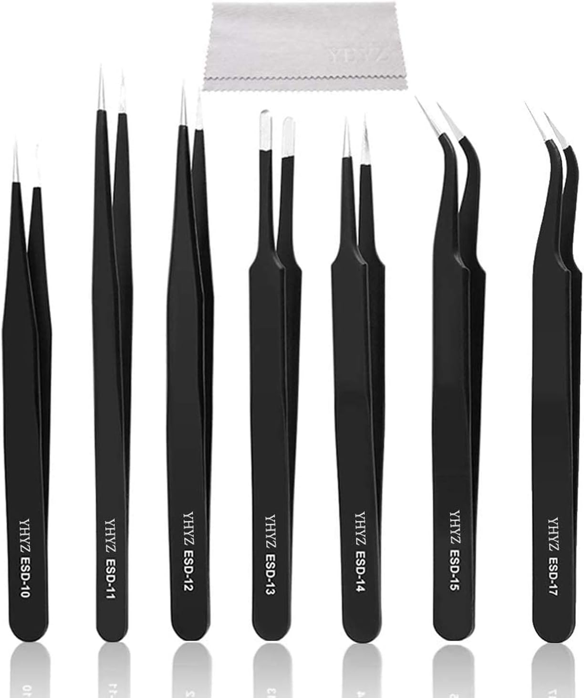
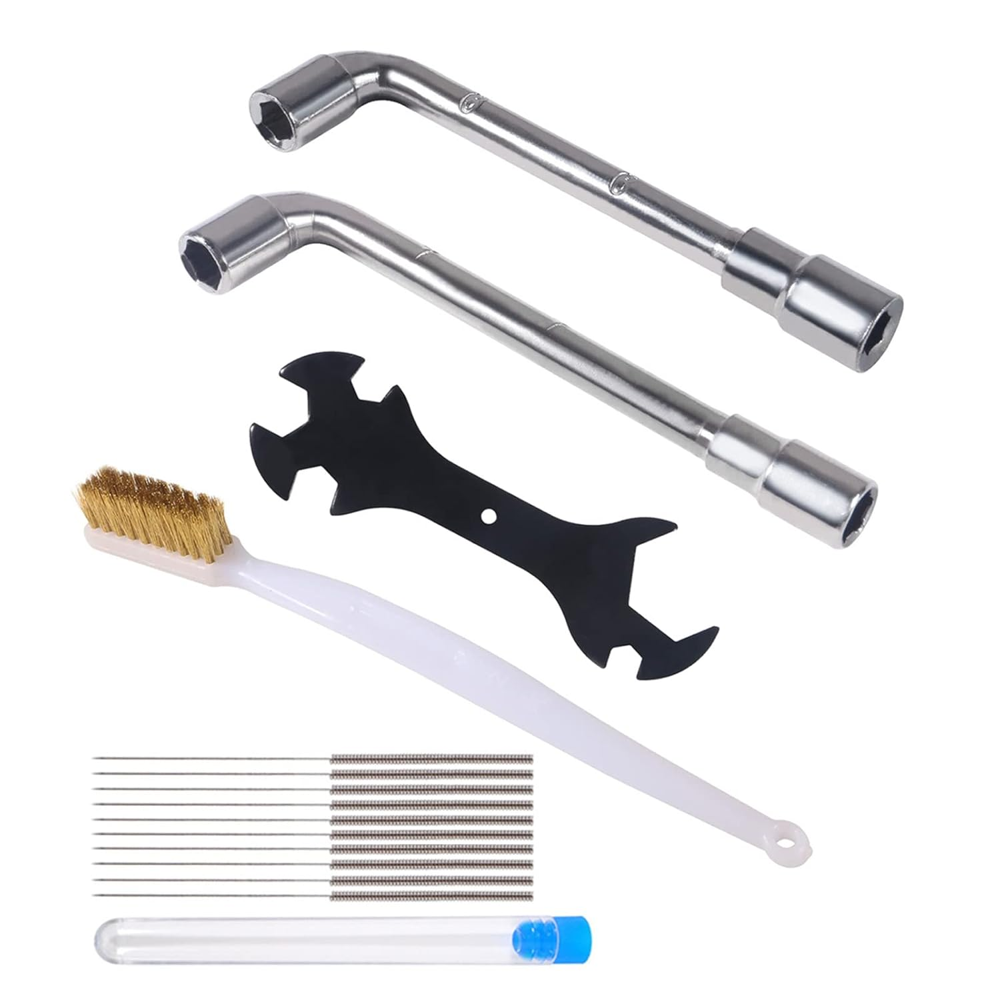
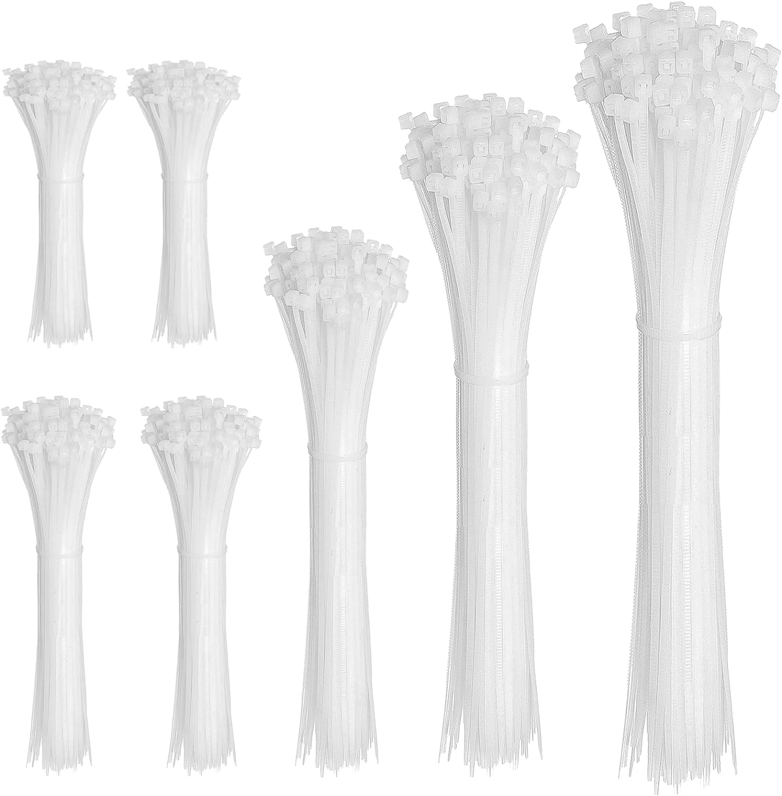
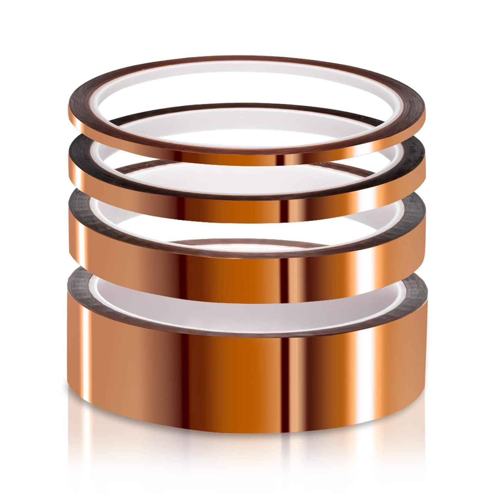

# Recommended Tools
Working on your printer can benefit from some extra tools. The following are tools that are helpful if you're looking at making physical modifications to your printer.

This list includes both tools that are included with the printer and ones not included. This document doesn't make any specific brand recommendations. Images for are example and links are for a search on Amazon US that should provide some adequate options.

## Allen Wrenches (Included)
Your printer comes with a set of Allen Wrenches, also called Hex Keys. The set comes with sizes that match all the screws that are used on the printer. These are perfectly adequate for the job.

## Flush Cutters (Included)
When you're working with modifications that use wiring, you may need to cut the zip ties that hold together the wires in the base. For that, small cutters are useful. You can use the flush cutters that are included with the printer for snipping these.

## Screwdrivers

[//]: # (![example screwdriver set]&#40;images/tools-screwdrivers.jpg&#41;{: style="height:150px;width:150px" align=right})
{: style="max-width:150px" align=right}

Some parts, like the fans on the printer, the power supply mounting screws, and the bottom panel, are fastened with Phillips screws. Some of these screws are small, so a standard size screwdriver will not fully work. You should have handy sizes PH0, PH1, and PH2.

[Search: Screwdriver Set with PH0](https://www.amazon.com/s?k=screwdriver+set+with+ph0)

## Precision Tweezers
{: style="max-width:150px" align=right}

Removing cables on your printer can be tough with just fingers. Some precision tweezers can give you a lot better control and grip on the wire connector. It's also useful for removing any hot glue that's been installed on the connectors at the factory. While you can also use the flush cutters to do this, that's very risky and more likely to cause a cut wire.

[Search: Precision Tweezer Set](https://www.amazon.com/s?k=Precision+Tweezer+Set)

## Nozzle Wrench (Included, but Upgrade)
{: style="max-width:150px" align=right}

When you need to change your nozzle, you can use the flat wrench included in the printer tools, but you may want to upgrade to a socket-style wrench as it's easier to manage. A small tool kit can provide this socket wrench and some other nice-to-have parts like angle tweezers.

[Search: 3D Printer Nozzle Wrench](https://www.amazon.com/s?k=3d+printer+nozzle+wrench)

## Zip Ties
{: style="max-width:150px" align=right}
If you're cutting ties, you will need replacements. Nylon zip ties are fairly cheap, so buying an assortment of sizes is useful.

[Search: Assorted Nylon Cable Ties](https://www.amazon.com/s?k=assorted+nylon+cable+ties)

## Polyimide (Kapton) Tape
{: style="max-width:150px" align=right}
For some modifications, you may need to run wires near sharp metal pieces. To reduce the risk of the wire being damaged, you can cover the sharp edge with tape. Do not use just any tape, though. You will want something that's resistant to heat, decently insulating, and thin enough it doesn't affect the fit between parts. A good option is polyimide tape. It's also often called heat tape or Kapton tape, after the brand name. A small assortment is useful in projects. Since it can withstand up to 400°C, some people also have used it on their build plate to give it an extra smooth texture in place of a glass or smooth PEI plate.

[Search: Polyimide Tape](https://www.amazon.com/s?k=polyimide+tape)

