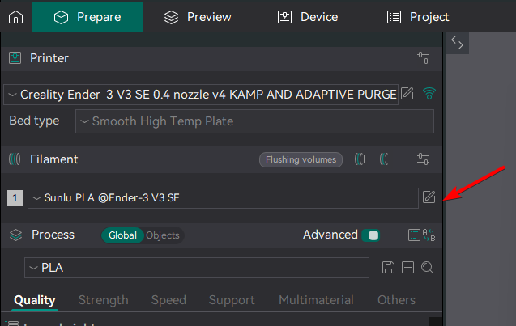
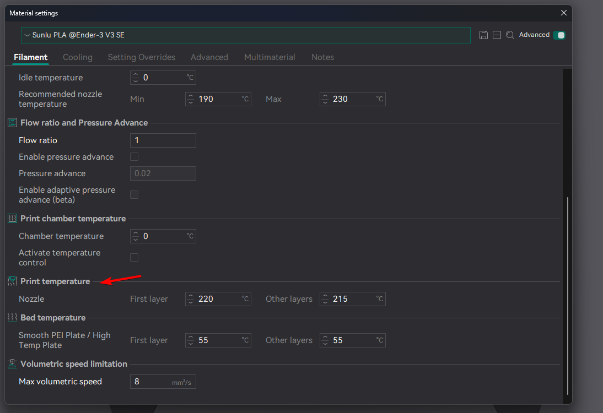
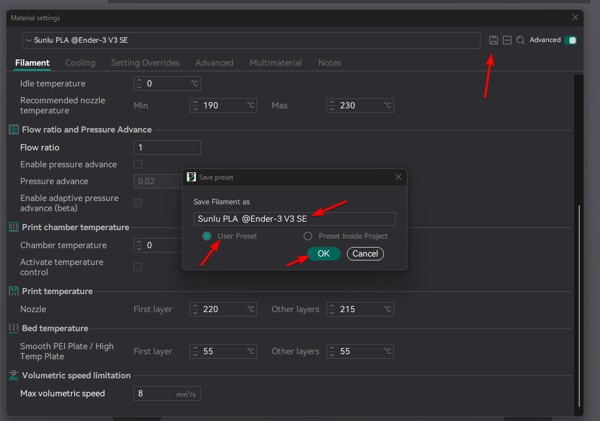
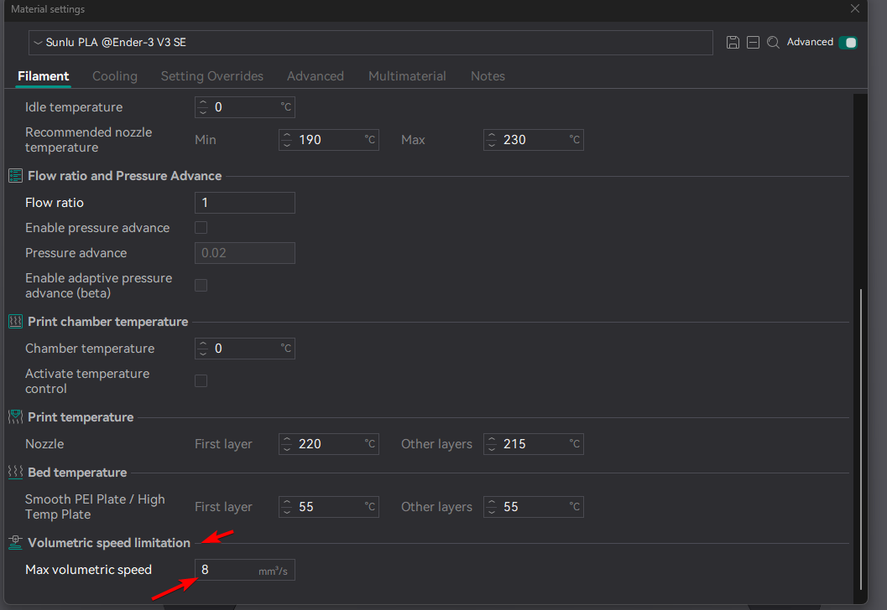
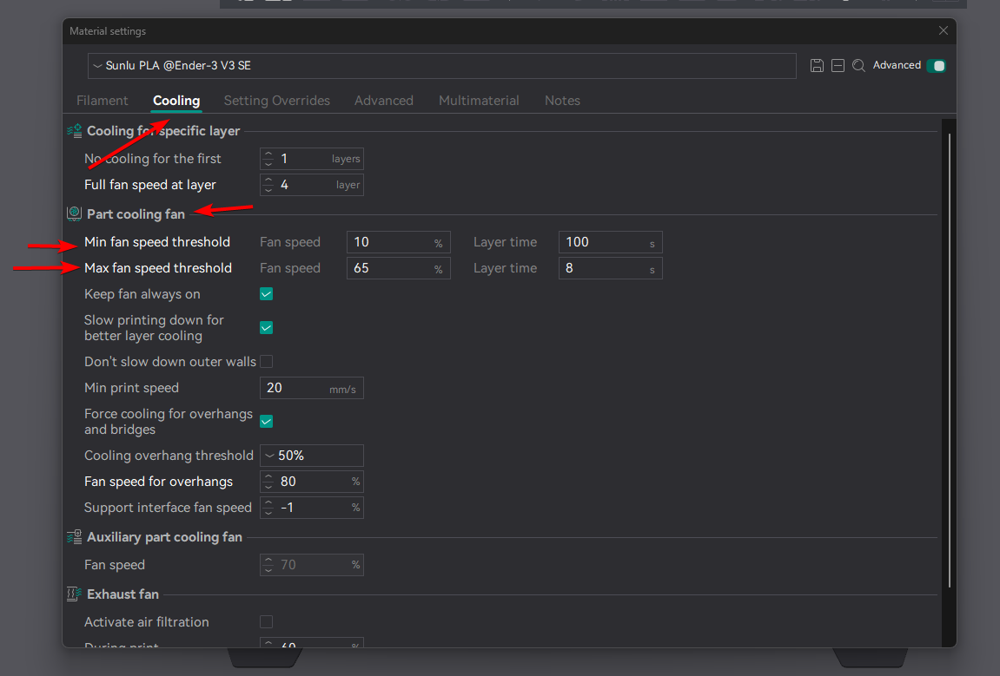

# Setting Up Filament Profile

- [Changing temperature of nozzle and pad.](#changing-temperatures-of-nozzle-and-pad)
- [Changing Flow Rate](#changing-flow-rate)
- (Optional) [Changing Part Cooling Speed, if you have dual 5015s](#cooling-speed-changes)

## Changing temperatures of nozzle and pad

1. Open OrcaSlicer.
2. Click prepare tab.
3. Click on Edit Icon next to the filament profile.
    
4. Scroll down to **Prining tempreture**
    
5. Change Nozzle temperature for your first layer and other layers. My recommendation is to use this formula:
    - First Layer: Recommended printing temperature of the filament roll, the middle of the range + 5c
    - Other Layers: Recommended printing temperature of the filament roll, the middle of the range
    - For example: 
        - First Layer: **220**
        - Other Layers: **215**
6. Scroll down to **Bed tempreture**
7. Change the bed temperature, based on recommended temperature. As always I recommend the middle of the range, 
for **First layer** and **Other layers**.

    !!! warning "Note"
        The bed temperature will be different, as stock bed has decent adhesion for pla. 
        But this will differ if you use PEI or other type of sheets.

8. Click save icon.
9. Name the profile. My recommendation is to use this naming schema: **Brand+filament type+@printer name**, for example **Sunlu PLA @Ender-3 V3 SE** 
10. Click **User preset**
11. Click **ok**.

    

## Changing Flow rate

1. Open OrcaSlicer.
2. Click prepare tab.
3. Click on Edit Icon next to the filament profile.
   
4. Scroll down to **Volumetric speed limitation**
5. If you use stock one, I recommend setting it to **8**
    
6. Click save icon.
7. Name the profile. My recommendation is to use this naming schema: **Brand+filament type+@printer name**, for example **Sunlu PLA @Ender-3 V3 SE**
8. Click **User preset**
9. Click **ok**.
   

## Cooling Speed Changes

!!! danger "Note"
    Change only if you use **dual cooling fans**, like 5015s.

1. Open OrcaSlicer.
2. Click prepare tab.
3. Click on Edit Icon next to the filament profile.
   
4. Click **Cooling** tab.
5. Scroll to **Part colling fan**.
6. Change these values:
    - Min fan speed threshold:
        - Fan speed: **10**
        - Layer time: **100**
    - Max fan speed threshold:
        - Fan speed: **65**
        - Layer time: **8**

    
7. Click save icon.
8. Name the profile. My recommendation is to use this naming schema: **Brand+filament type+@printer name**, for example **Sunlu PLA @Ender-3 V3 SE**
9. Click **User preset**
10. Click **ok**.
    