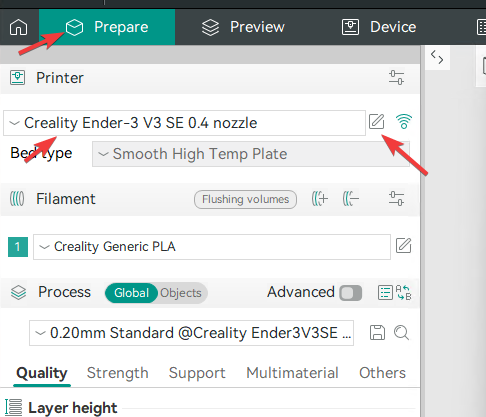
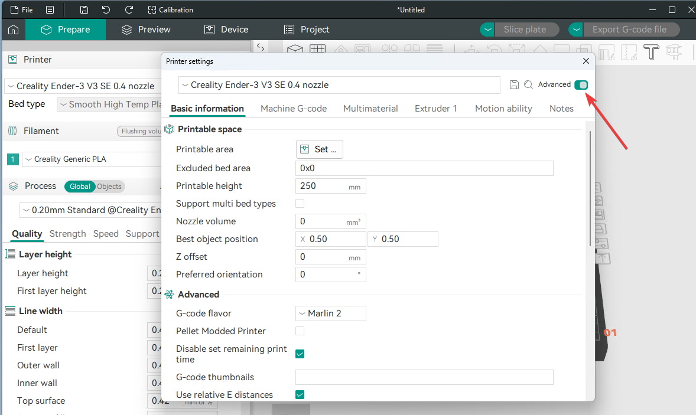
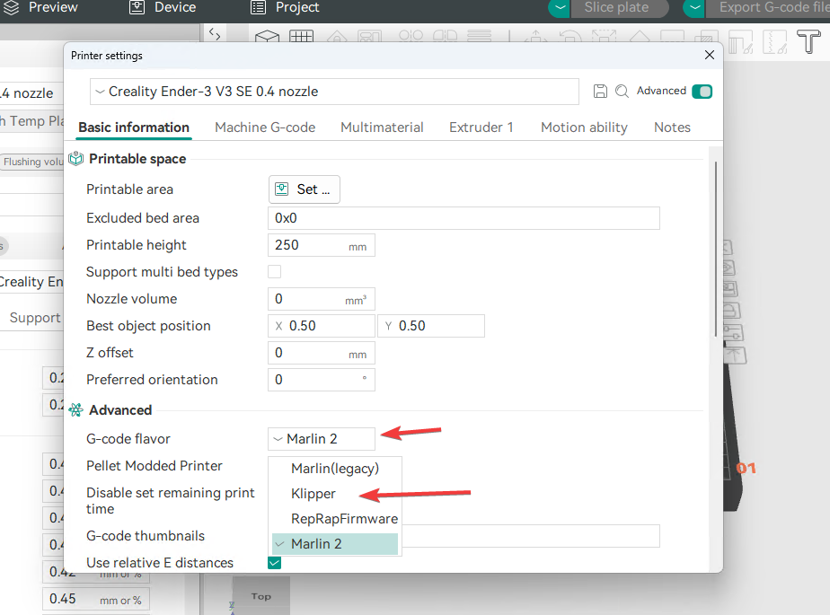
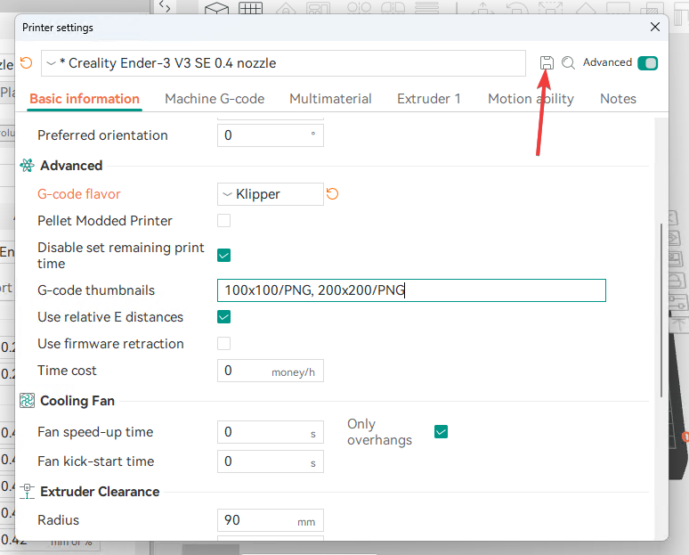
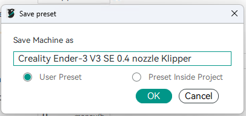

# Setting up printer profile

1. Open any project or click **Prepare** tab.
2. Click edit icon next to your printer name.
    
3. In printer settings, enable **Advanced mode**
    
4. In advanced section, change **g-code flavour** from **Marlin 2** to **klipper**.
    
5. For **thumbnails** enter `100x100/PNG, 200x200/PNG`.
!!! warning "Note" 
    Thumbnails will work only on **guppy screen** and **fluid**. For the original nebula pad screen, it will only show in files. If you start prints remotely.
6. Click save.
    
7. Name the profile however you want, I will name it **Creality Ender-3 V3 SE 0.4 nozzle Klipper**.
8. Click ok.

    

9. Click `X` to close the window.