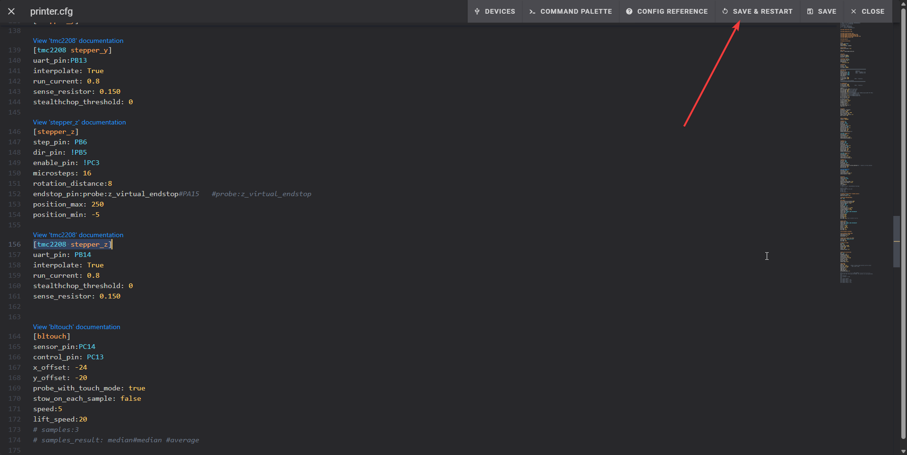

# Fixing Layer shift and nozzle grinding prints

!!! warning "At Your Own Risk"
 The following requires editing the printer configuration files on the Nebula Pad. As these configuration files adjust how the printer hardware works, bad edits may break your hardware or cause other [safety](../../safety.md) issues. **Make sure to read the full process before starting and follow each step closely.**

1. Open Fluid in your browser or Ocra slicer, for this tutorial will use the browser, 
but if you have Ocra slicer set up, **skip to step 4**.
2. Open your browser.
3. Type `YOUR_PRINTER_IP:4408` for example `192.168.0.100:4408` and click enter.
4. Click on icon that look like ":material-code-json:".
    
5. Find file named `printer.cfg` and open it.
    
6. When you see a lot of text in there, `CTRL + F` to open search function.
7. In search bar type `[tmc2208 stepper_y]`. It should take you to the exact text you typed, if not, 
use arrow keys to navigate down.
8. You should see something like this:
    ``` cfg
    [tmc2208 stepper_y]
    uart_pin:PB13
    interpolate: True
    run_current: 0.6
    sense_resistor: 0.150
    stealthchop_threshold: 0 
    ```
9. Now edit line `run_current: 0.6` to `run_current: 0.8`
    ``` cfg
    [tmc2208 stepper_y]
    uart_pin:PB13
    interpolate: True
    run_current: 0.8
    sense_resistor: 0.150
    stealthchop_threshold: 0 
    ```
    
10. Now in search bar type `[tmc2208 stepper_z]`, it should take you to something like this.
    ``` cfg
    [tmc2208 stepper_z]
    uart_pin: PB14
    interpolate: True
    run_current: 0.6
    stealthchop_threshold: 0
    sense_resistor: 0.150
    ```
11. Change the value of `run_current: 0.6` to `run_current: 0.8` like this:
    ``` cfg
    [tmc2208 stepper_z]
    uart_pin: PB14
    interpolate: True
    run_current: 0.8
    stealthchop_threshold: 0
    sense_resistor: 0.150
    ```
    

Note: If you are still experiencing layer shift or Z-related print issues after the above change, you can cautiously bump the Z-axis `run_current` up to 0.85. Make small incremental changes, test between edits, and monitor driver/board temperatures — higher currents can increase heat. Proceed at your own risk.

12. Click `Save & Restart`
    
