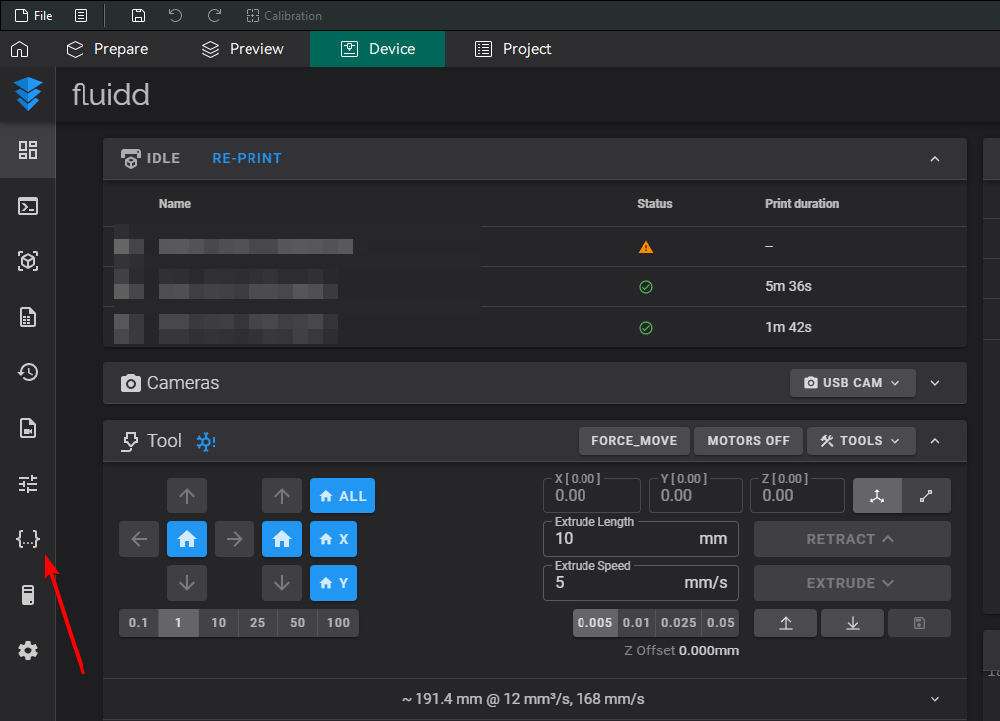
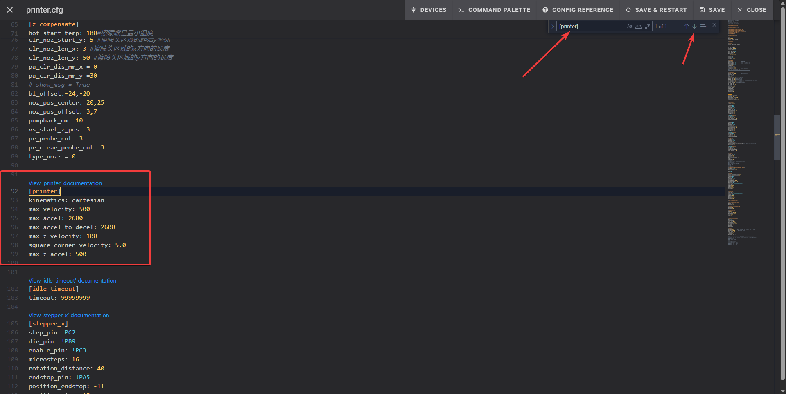

# Limiting Speed of the printer

!!! warning "At Your Own Risk"
    The following tweaks require editing the printer configuration files on the Nebula Pad. As these configuration files adjust how the printer hardware works, bad edits may break your hardware or cause other [safety](../../safety.md) issues. **Make sure to read the full process before starting and follow each step closely.**

1. Open Fluid in your browser or Ocra slicer, for this tutorial will use the browser,
   but if you have Ocra slicer set up, **skip to step 4**.
2. Open your browser.
3. Type `YOUR_PRINTER_IP:4408` for example `192.168.0.100:4408` and click enter.
4. Click on icon that look like `{...}`.
   
5. Find file named `printer.cfg` and open it.
   
6. When you see a lot of text in there, `CTRL + F` to open search function.
7. In search bar type `[printer]` and you should see something like this:
   ``` cfg
   [printer]
    kinematics: cartesian
    max_velocity: 500
    max_accel: 5000
    max_accel_to_decel: 5000
    max_z_velocity: 100
    square_corner_velocity: 5.0
    max_z_accel: 500 
   ```
8. Change the lines:
   - `max_accel: 5000` to `max_accel: 2600`
   - `max_accel_to_decel: 5000` to `max_accel_to_decel: 2600`
9. After changing them, they should look like this:
   ``` cfg
   [printer]
    kinematics: cartesian
    max_velocity: 500
    max_accel: 2600
    max_accel_to_decel: 2600
    max_z_velocity: 100
    square_corner_velocity: 5.0
    max_z_accel: 500
   ```
   
10. Click `Save & Restart`
       
